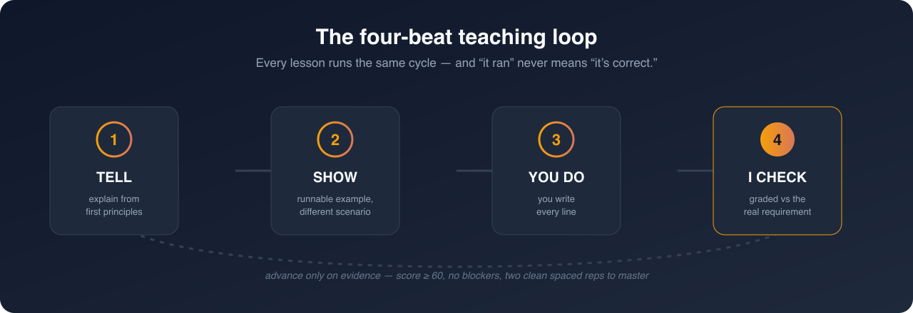
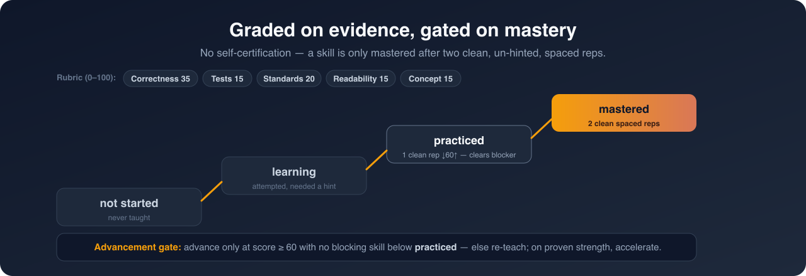
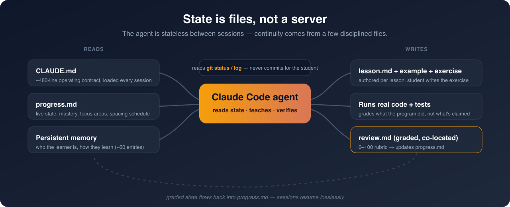
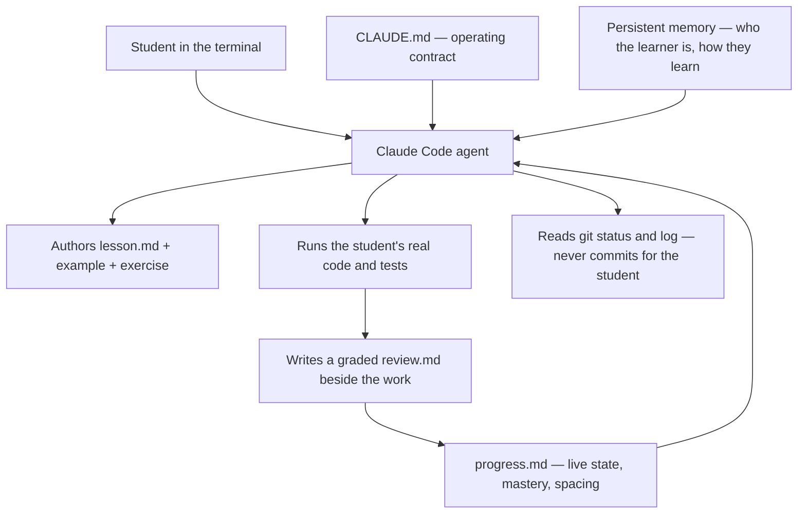
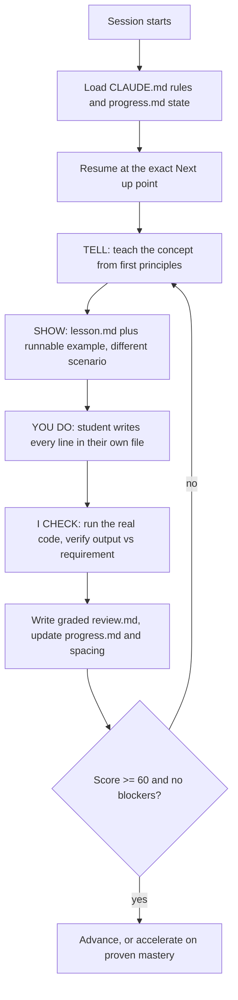
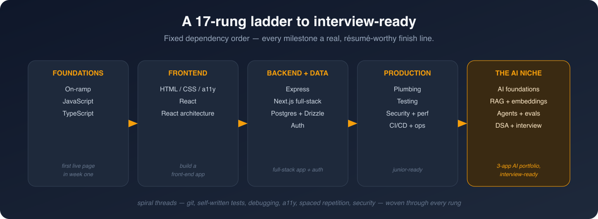

# AI Code Coach — Case Study

> **An AI coding tutor that reads a student's code and coaches them — without ever writing it for them.**
> 🚧 In active development. This repository is a written case study of the system's design.

  

> [!NOTE]
> **This repo is a static case study — Markdown and diagrams only.**
> There is no application server here, no API keys, and no product screenshots.
> The coach runs as an agent inside [Claude Code](https://claude.com/claude-code);
> a live walkthrough is available on request.

---

## The problem

Most ways to learn to code fail in the same way: they hand you the answer. A YouTube tutorial types it for you. A bootcamp paces it for someone else. And a general-purpose AI assistant will happily write the whole function — which feels productive and teaches you nothing. People watch hundreds of hours and still go blank the moment they have to write code themselves.

I teach people to code, and I kept watching the same thing happen. **AI Code Coach is the tutor I wished my students had:** it reads what they wrote, asks the right question, and makes them write the next line themselves.

---

## What it is

An **adaptive tutoring agent that runs inside a real terminal** (Claude Code). Because it lives where the code lives, it can do what a screen-recorded course or a chat window can't: create the lesson files, run the student's actual code, and read their real `git` and test output — then grade against what the program *did*, not what the student claims it does.

There is no separate web app, database, or billing to run. The entire coach is a **rulebook plus a file-based memory of the learner** — a ~480-line operating contract (`CLAUDE.md`) the agent loads every session, a live progress tracker it reads and writes, graded review files co-located with each exercise, and a persistent cross-session memory of who the learner is and how they learn best. That's the product: the *behavior*, encoded as enforceable rules.

  

---

## How the AI actually teaches

The coaching behavior is the product, and it's enforced by an operating contract the agent must follow every session — not left to the model's mood.

**1. The no-code rule (a hard constraint).** The agent will not write, complete, or fill in a single line of the student's code. Mid-exercise help explains the *concept* with a worked example in a **completely different domain**, with different variable names, so the exercise answer can't leak. The real solution appears **only** in the post-submission review — and there's an explicit trap for the obvious workaround: try to fish the answer out by leaving "learn mode" and the agent recognizes it and redirects.

**2. The four-beat loop, every lesson.** **TELL** (teach from first principles, define jargon before use) → **SHOW** (a readable lesson plus a runnable, commented example in a *different* scenario than the exercise) → **YOU DO** (the student writes every line in their own file, with an exact run command and expected output) → **I CHECK** (the agent runs the code and grades the *real output* against the requirement). The governing rule: **"it ran" is never the same as "it's correct."**

**3. It grades on evidence, not vibes.** Every submission is scored on a 0–100 rubric (Correctness · Tests · Standards · Readability · Concept grasp) written to a `review.md` file co-located with the work. Skills move through `not started → learning → practiced → mastered`, and a skill is only *mastered* after **two clean, un-hinted reps on separate, spaced occasions.**

**4. Advancement gates that won't let you skip.** The student advances past a lesson only when they score **≥ 60 and have no blocking skill still below `practiced`.** Below that, the agent re-teaches the failing micro-skill in a fresh scenario; on proven strength it *accelerates* — compressing drills or offering a test-out. The pace adapts in **both** directions.

**5. It stays on the lesson.** A learn-mode gate keeps the agent scoped to the current lesson and already-taught material; off-topic asks are parked on the roadmap and redirected, instead of turning into a free-for-all chatbot.

**6. Silent learner guardrails.** Always-on detectors watch for frustration (stop advancing, shrink to a winnable step), copy-paste / AI-submitted work (met with *"walk me through line N — what does it do and why?"*), perfectionism (every task is time-boxed), and vocabulary gaps (periodic "define X vs Y" checks) — each one changes *how* the agent teaches on the fly.

  

<em>Every skill is scored, and no one advances past a lesson without the evidence to back it.</em>

---

## Architecture

The "architecture" here is deliberately not a server diagram — it's a **context and state design.** The agent is stateless between sessions; continuity comes entirely from a small set of disciplined files it reads and writes.

  

Every lesson runs the same disciplined loop, and state is persisted so a session can be cleared and resumed losslessly:

That ordering — **load state → teach → student builds → verify real output → grade → gate** — is a project-wide rule, on every lesson, no exceptions.

---

## Notable design decisions

- **The rulebook is the source of truth.** All coaching behavior — the no-code rule, the grading rubric, the enforcement ramp, the guardrails — lives in one versioned `CLAUDE.md` contract the agent reloads every session. Changing how the coach behaves is a documented edit, not a code deploy.
- **State is files, not a database.** A single hot `progress.md` holds current state, skill mastery, focus areas, and a spaced-repetition schedule; graded reviews are co-located with the work they grade. Anyone can read the whole story of one unit of work by opening one folder.
- **Persistent, cross-session learner memory.** A durable memory store (~60 entries and growing) records who the learner is and how they learn — preferences, recurring error patterns, format asks, frustration triggers — so coaching compounds across sessions instead of resetting each time.
- **Context is a budget.** Only the two lean hot files load every session; deep pedagogy, history, and per-topic playbooks live in cold files read on demand, and the agent flags natural `/clear` points once state is saved — keeping the working context sharp and cheap.
- **Verify before handing anything over.** A hard gate forbids showing the student code the agent hasn't compiled and run: every snippet is type-checked and executed, shared identifiers are cross-checked across spec / test / starter files, and the verification receipt is shown in-message. Eyeballing adapted example code is banned.
- **Docs verified against current sources.** Before any lesson touches a library, its API is checked against current official docs (via Context7 / official sources), pinned to the non-deprecated version — never taught from memory — and the student is coached to decode a real hover signature into plain English themselves, so their reliance on AI *drops*.
- **Git stays in the student's hands.** The agent teaches and verifies version control but never runs `git` for the student — every submission is their own commit on their own branch.

---

## The pedagogy, encoded

| Mechanism | What it enforces |
|---|---|
| **No-answers rule** | Different-scenario help only; the solution appears solely in the review |
| **Four-beat loop** | TELL → SHOW → YOU DO → I CHECK, with real-output verification |
| **0–100 rubric** | Correctness 35 · Tests 15 · Standards 20 · Readability 15 · Concept 15 |
| **Mastery ladder** | `not started → learning → practiced → mastered` on objective, spaced evidence |
| **Advancement gate** | Advance only at ≥ 60 with no blockers; remediate or accelerate |
| **Enforcement ramp** | A small graded core early; each standard switched on (and announced) at its home module |
| **Spaced repetition** | A spacing schedule resurfaces due topics via `drill me` / `leet me` / `test your skills` |
| **Module-exit gate** | No module completes without exercise + drill + syntax drill + one cohesive program, each graded |

---

## The curriculum it drives

A fixed 17-rung dependency ladder (M0–M16) from foundations to interview-ready in the AI niche, each rung a real, résumé-worthy capability milestone:

  

**Foundations & language** — beginner on-ramp · JavaScript · TypeScript
**Frontend** — web platform / HTML-CSS-a11y · React · React application architecture (Zustand, TanStack Query & Table, RHF + Zod, dnd-kit, Motion)
**Backend & data** — type-safe Express · Next.js App Router full-stack · Postgres + Drizzle on Neon · authentication & authorization
**Production** — real-world plumbing (uploads, email, webhooks, rate limiting) · testing & quality (Vitest, Testing Library, Playwright) · security & performance hardening · deployment, CI/CD & prod ops
**The AI niche** — AI foundations (Vercel AI SDK) · RAG & embeddings (pgvector) · agents, tools & evals — ending in a **three-app deployed AI portfolio** and a DSA / interview-readiness sprint.

Spiral threads (git, self-written tests, debugging, accessibility, spaced repetition, security mindset, requirements gathering, data-analysis mindset, and more) are woven through **every** module rather than taught once. The first live page ships in week one.

---

## Status & contact

🚧 **In active development.** I'm happy to give a live walkthrough of the agent teaching a real lesson end to end.

📫 **Joe Letner** — jrletner@gmail.com · [LinkedIn](https://www.linkedin.com/in/joe-letner-4a37ba99/)
