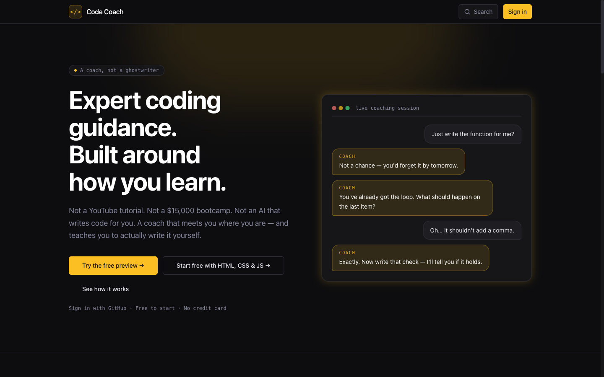
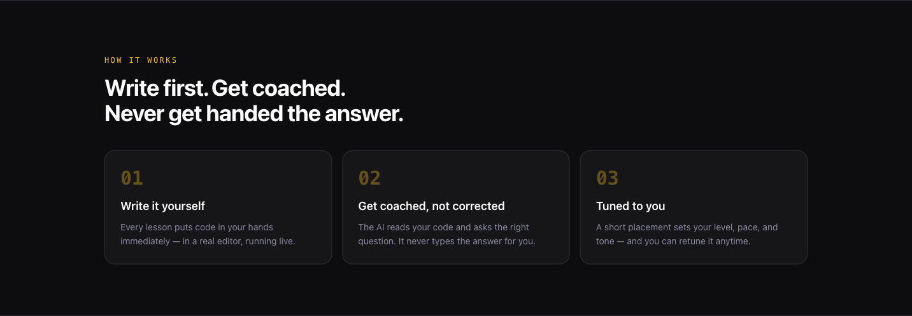
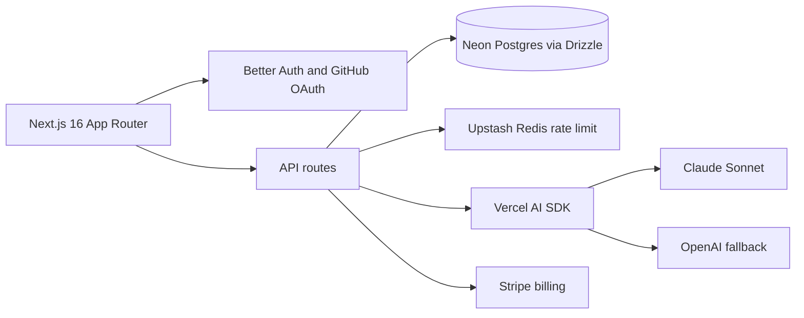
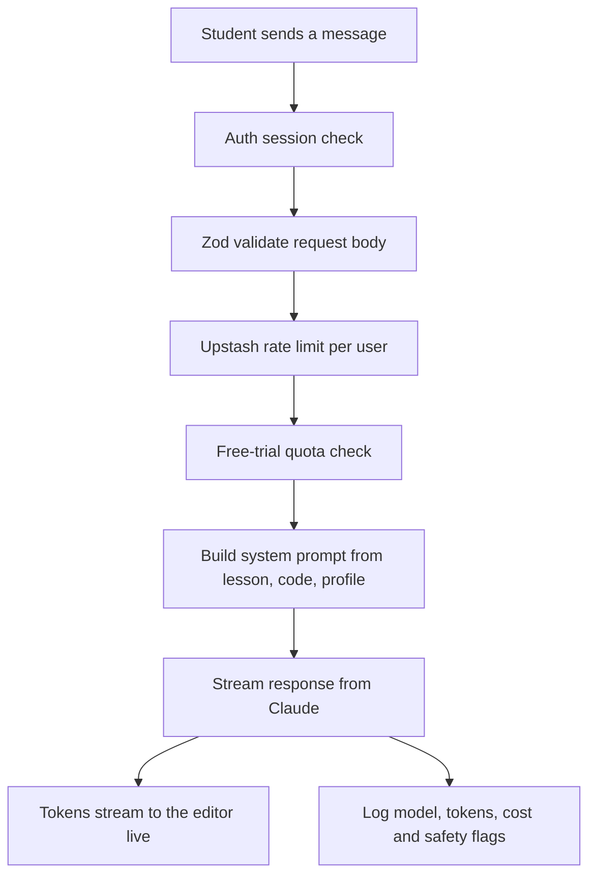

# AI Code Coach — Case Study

> **An AI coding tutor that reads a student's code and coaches them — without ever writing it for them.**
> 🚧 In active development. The application code is private; this repository is a written case study.

<p align="center">
  
</p>

> [!NOTE]
> **This repo is a static case study — Markdown, diagrams, and screenshots only.**
> There is no application here, no API keys, and no AI calls. Viewing or cloning it
> cannot consume any AI tokens or hit any model. A live walkthrough of the real app
> is available on request.

---

## The problem

Most ways to learn to code fail in the same way: they hand you the answer. A YouTube tutorial types it for you. A bootcamp paces it for someone else. And an AI assistant will happily write the whole function — which feels productive and teaches you nothing. People watch hundreds of hours and still go blank the moment they have to write code themselves.

I teach people to code, and I kept watching the same thing happen. **AI Code Coach is the tutor I wished my students had:** it reads what they wrote, asks the right question, and makes them write the next line themselves.

---

## What it is

A full-stack learning platform where every lesson drops the student into a real, running code editor. An AI coach sits alongside them — it can see their code and their live preview output, and it coaches toward the answer instead of giving it. Learners tune how it teaches (style, level, and tone), and the whole thing is wrapped in real auth, billing, rate limiting, and an admin authoring suite.

<p align="center">
  
</p>

---

## How the AI actually teaches

The coaching behavior is the product, and it's enforced in the system prompt — not left to chance. Every tutor request builds a fresh prompt from a few hard rules plus the learner's settings.

**1. The no-code rule (a hard constraint).** The model is instructed, in every request, to never write, complete, or fill in a single line of the student's code. It *may* read their code and give line-specific observations ("on line 3 your object is missing a closing brace"); any worked example must use a completely different domain and variable names so it can't leak the exercise answer.

**2. Socratic by design.** Instead of producing a solution, the coach asks the next guiding question and hands the keyboard back.

<p align="center">
  
</p>

**3. It adapts to the learner.** Three dimensions are injected into the prompt per request:

| Dimension | Options |
|---|---|
| **Learning style** | Visual (every answer includes an auto-generated Mermaid diagram) · Step-by-step (smallest numbered steps) · Socratic (questions first) |
| **Skill level** | From "explain like I'm a child, zero jargon" up to "terse, precise, internals and edge cases" |
| **Strictness / tone** | A 1–10 dial from warm-and-encouraging to direct-and-unsparing |

**4. It stays on the lesson.** An off-topic gate keeps the tutor scoped to the current lesson (and prior lessons in the course); unrelated questions get a fixed redirect instead of a free-for-all chatbot.

**5. It's prompt-injection safe.** Student code and rendered preview output are passed to the model strictly as *delimited data*, never as instructions — so nothing a student types (or a lesson contains) can hijack the coach.

```ts
// Illustrative shape of buildSystemPrompt() — assembled fresh per request
const parts = [
  baseRole,                       // who the coach is
  NO_CODE_RULE,                   // hard constraint: never write their code
  offTopicGate(priorLessons),     // stay scoped to the lesson
  learningStyleInstruction(style),// visual | step-by-step | socratic
  skillLevelInstruction(level),   // dummy → advanced
  toneInstruction(strictness),    // warm (1) → unsparing (10)
  `=== STUDENT CODE START ===\n${code}\n=== STUDENT CODE END ===`,     // data, not instructions
  `=== RENDERED PREVIEW START ===\n${preview}\n=== RENDERED PREVIEW END ===`,
];
```

There's also a second, cheaper model running in the background to classify each exchange (sentiment, spam, misuse, off-topic, whether a diagram was requested) — so the expensive coaching model isn't paying for triage.

---

## Architecture



Every AI route runs the same disciplined request pipeline — auth, validate, throttle, then work:



That ordering is a project-wide rule: **auth → validate → rate limit → work**, on every route, no exceptions.

---

## Notable engineering decisions

- **One source of truth for course behavior.** A central config object drives editor type, runner, file handling, and AI behavior per course — so adding a course is a single change, not a hunt for scattered `if (course === "react")` branches.
- **Custom in-browser runners, no bundler.** JavaScript, HTML, single-file React (via Babel UMD), and a client-side multi-file module registry all run live in a sandboxed iframe with a console shim — students see output instantly with no build step.
- **Streaming-first.** The tutor streams tokens into the editor in real time via the Vercel AI SDK; classification and grading use one-shot structured calls.
- **Full AI audit trail.** Every model call is logged with route, model, token counts, estimated cost, latency, and the safety flags — feeding admin dashboards and cost visibility.
- **Defense in depth.** Build-time env validation (`@t3-oss/env-nextjs`, no inline `process.env`), per-route Upstash rate limits that fail *open* (a Redis blip shouldn't lock out learners), DOMPurify on rendered HTML, and CSP/HSTS headers.
- **Mermaid that doesn't break.** Because the visual learning style asks the model for diagrams, the prompt carries a strict Mermaid sub-grammar to keep generated diagrams parseable.

---

## Stack

| Layer | Choice |
|---|---|
| **Framework** | Next.js 16 (App Router, React 19), TypeScript (strict) |
| **Auth** | Better Auth + GitHub OAuth, role-based (student / admin) |
| **Data** | Neon Postgres · Drizzle ORM |
| **AI** | Vercel AI SDK · Claude (Anthropic) primary, OpenAI fallback |
| **Rate limiting** | Upstash Redis |
| **Payments** | Stripe (courses, bundles, subscriptions, coupons) |
| **Editor** | CodeMirror 6 + custom runners |
| **UI** | shadcn/ui (Radix) · Tailwind CSS · Mermaid · Sonner |
| **Ops** | Sentry monitoring · AI-call audit logging |

---

## Scope at a glance

- A typed API surface organized by feature — auth, the AI coaching pipeline, courses & enrollment, progress, student code/notes, billing, and an admin authoring suite
- A relational schema covering users & profiles, courses & multi-file lessons, enrollment & progress, persisted chat, a full billing model, and an AI audit log
- An adaptive learner profile: skill level, learning style, and a strictness dial, set by a placement step and re-tunable anytime

*Some platform features (e.g. the skill-map UI and streaks) are intentionally deferred post-launch and are not described above.*

---

## Status & contact

🚧 **In active development** — private beta in progress. The source is private; I'm happy to give a live walkthrough.

📫 **Joe Letner** — jrletner@gmail.com · [LinkedIn](https://www.linkedin.com/in/joe-letner-4a37ba99/)
